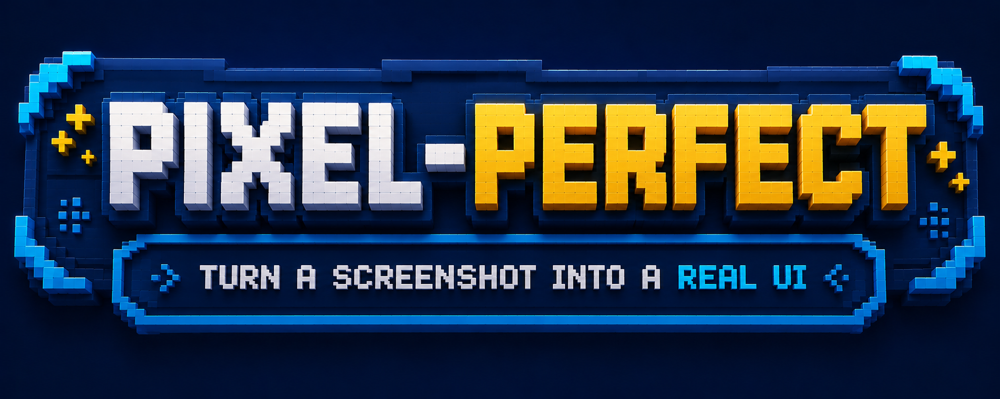

<p align="center">
  
</p>

# Turn a screenshot into a real UI—without the CSS guessing game.

Give your coding agent a reference image and let **Pixel-perfect** handle the hard visual work.

Build closer matches faster, keep your existing app intact, and spend less time nudging CSS by hand. No screenshot-as-background hacks. No random CSS thrashing. Just a smoother path from reference image to polished UI.

## Proof, not promises

The `examples/` directory includes a real dashboard reference and the recreated result:

<p align="center">
  
  
</p>

<p align="center"><em>Reference on the left · recreated result on the right</em></p>

<p align="center"><strong>Proof case:</strong> produced with the GPT Luna Thinking Max model using the Pi harness.</p>

## Try it in 10 seconds

From this repository:

```bash
npx skills use . --skill pixel-perfect
```

That generates a one-off prompt for the skill. It does not install anything or modify your project.

Want the CLI to start a supported agent for you?

```bash
npx skills use . --skill pixel-perfect --agent pi
```

Or pipe the generated prompt into an agent that accepts stdin:

```bash
npx skills use . --skill pixel-perfect | claude
```

> For a local checkout, use `--skill pixel-perfect`. `.@pixel-perfect` is not valid local-source syntax.

## Install it where the work happens

Install the skill into a consuming project so your agent can discover it on every task:

```bash
cd /path/to/your-project

npx skills add /path/to/pixel-perfect \
  --skill pixel-perfect \
  --agent pi \
  --copy \
  --yes
```

That installs the project skill at `.pi/skills/pixel-perfect` and records the source in `skills-lock.json`.

Supported agent targets include:

```text
pi · codex · claude-code · cursor
```

Use the target agent's name with `--agent`. Install globally with `--global` (or `-g`) when you want the skill available across projects:

```bash
npx skills add /path/to/pixel-perfect \
  --skill pixel-perfect \
  --agent pi \
  --global \
  --copy \
  --yes
```

To install directly from this directory instead:

```bash
npx skills add . --skill pixel-perfect --agent pi --copy --yes
```

## Use it

1. Install the skill in your application project.
2. Start your coding agent from that project.
3. Ask it to reproduce a reference image, for example:

   > Reproduce `reference.png` with the existing app. Preserve the current architecture and make the result look as close to the reference as possible.

The skill helps your agent:

- turn reference images into polished, production-ready interfaces;
- preserve your framework, architecture, and existing behavior;
- make visual improvements with less guesswork and rework;
- keep results repeatable across browsers and screen sizes;
- check the details that matter before you call the work done.

It improves the UI without turning your application into a screenshot-shaped shell.

## See what is installed

```bash
# Inspect the skills available in this source
npx skills add . --list

# List project installations
npx skills list

# Machine-readable output
npx skills list --json
```

## Update or remove it

```bash
npx skills update pixel-perfect --project --yes
npx skills remove pixel-perfect
```

For a global installation, use `--global` with the update or remove command.

## Run the bundled tooling

`npx skills` delivers the instructions, while the bundled Python tooling keeps visual checks repeatable:

```bash
python .pi/skills/pixel-perfect/scripts/pixel-perfect.py --help
```

Read [`SKILL.md`](SKILL.md) when you need the technical details.

## Requirements

- Node.js `22.20.0` or newer for the current `skills` CLI.
- Python `3.9` or newer for the bundled CLI.
- `npx`, included with npm.
- A vision-capable model that can understand reference images.
- A supported coding agent, such as Pi, Codex, Claude Code, or Cursor.

Check the CLI version:

```bash
npx skills --version
```

## One important note

Skills are instruction sets that agents may follow with their normal project permissions. Review `SKILL.md` and supporting files before installing a skill from an unfamiliar source.

**If your UI is judged by pixels, start here.**
